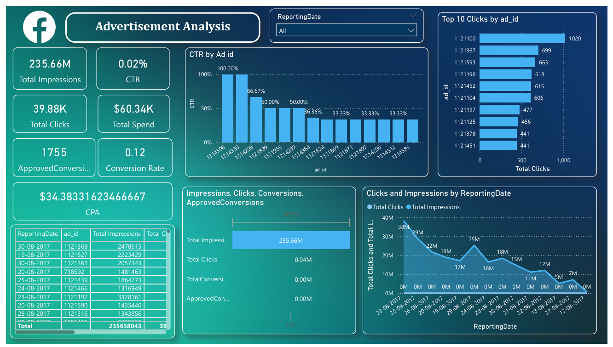
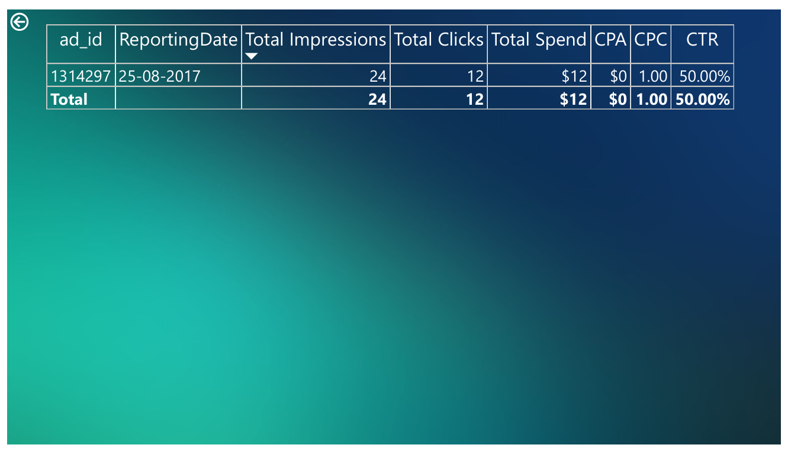

# FUTURE_DS_02
Advertisement Analysis - POWER BI

<h2>OBJECTIVE:</h2>
 to analyze campaign performance metrics and build an interactive dashboard that helps businesses answer questions.

<h2>DATASET:</h2>
<a href="data/data.csv">Dataset Link</a>

<h2>QUESTIONS:</h2>
1.) How well did the ad campaign perform? 
2.) Which posts or ads had the highest engagement? 
3.) What was the Click-Through Rate (CTR) and Return on Investment (ROI)? 
4.) What can we improve for the next campaign? 

<h2>DASHBOARD:</h2>

<h2>FINDINGS:</h2>
 
<OL>
 <li>235M+ Total Impressions generated across campaigns</li>
  <li>39K+ Clicks recorded with a CTR of 0.02% </li>
  <li>$60K+ Ad Spend with a CPA of $34.38</li>
  <li>Identified the Top 10 Ads driving the highest clicks and analyzed CTR performance across ad IDs</li>
  <li>Insights into conversion trends, spending efficiency, and click-through behaviour helped highlight which ads delivered the best ROI.</li>
</OL>

